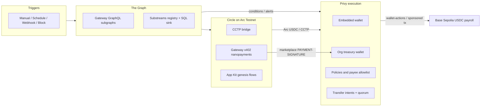

# Graphitti

Graphitti is the execution layer for businesses, users, and developers onchain: visual workflows that watch chain state (The Graph), send USDC (Privy and Arc), and sell the same graph per call over Circle Gateway x402.

  <video src="docs/media/graphitti-workflow-demo.mp4" width="720" controls playsinline>
    Your browser does not support embedded video. <a href="docs/media/graphitti-workflow-demo.mp4">Download the Graphitti workflow demo</a>.
  </video>

| Link | URL |
|------|-----|
| App | [graphitti-five.vercel.app](https://graphitti-five.vercel.app) |
| Docs | [Mintlify site](docs/) — run `mint dev` in `docs/` or open published docs from your deployment |
| Repository | [github.com/Bleyle823/Graphitti](https://github.com/Bleyle823/Graphitti) |
| Demo video | [Workflow demo](docs/media/graphitti-workflow-demo.mp4) (embedded above) |
| npm | [`@graphitti/graph-core`](https://www.npmjs.com/package/@graphitti/graph-core), [`@graphitti/privy-core`](https://www.npmjs.com/package/@graphitti/privy-core) |

## Architecture

Drop product screenshots under [`docs/images/product/`](docs/images/product/) (see that folder for filenames). Suggested captures:

| Slot | Alt text |
|------|----------|
| `privy-connect.png` | Privy connect modal |
| `uniswap-subgraph-canvas.png` | Uniswap V3 subgraph workflow on canvas |
| `kelp-canvas.png` | Kelp backing monitor graph |
| `supabase-backing-snapshots.png` | Supabase Table Editor `backing_snapshots` |
| `arc-defi-readiness.png` | Arc DeFi treasury readiness (CCTP / estimate / Arc USDC) |
| `marketplace-pay.png` | Marketplace pay toast or Earnings |
| `treasury-intent-approve.png` | Treasury 10 USDC cap, payee book, pending intent Approve |

## Featured workflows

Each template is available in the app workflow gallery. Problem, graph, and stack in brief:

| Workflow | What it does | Stack |
|----------|--------------|-------|
| **Uniswap V3 large swap alert (subgraph)** | Large swaps on Ethereum mainnet cross a threshold; notify via Telegram | The Graph Gateway GraphQL, Condition, Telegram |
| **Kelp rsETH Backing Monitor (Substreams → Supabase)** | Stream backing metrics; alert when `should_alert` | Substreams SQL sink, Supabase, Condition, webhook |
| **Arc DeFi treasury readiness** | Preflight funded source chain, CCTP, Arc USDC before DeFi steps | Arc App Kit, CCTP, Circle, Telegram |
| **FPL League Top Two USDC Payouts** | Conditional USDC payouts to league top two when prize pool covers amounts | FPL reads, Arc `send-on-arc`, Condition |
| **Payroll batch with intent fallback** | Transfers under policy cap via wallet-actions; larger amounts via intent + approval | Privy org treasury, policies, intents, Base Sepolia USDC |
| **Stripe invoice to Privy USDC settlement** | Invoice paid in Stripe; settle to org treasury in USDC | Stripe, Privy wallet-actions |
| **Privy Gasless Payroll** | Sponsored payroll transfers from org wallet | Privy sponsored transactions |
| **Aave Uniswap USDC keeper** | Keeper-style reads across Aave and Uniswap subgraph data | The Graph, protocol read nodes |
| **Org USDC waterline keeper** | Monitor org USDC balance against a waterline | Treasury reads, Condition |

More templates and marketplace listings use the same plugins; see [docs/treasury/overview.mdx](docs/treasury/overview.mdx).

## Evidence by integration

GitHub links point at `main`. Replace `YOUR_LINK` with explorer URLs, payment IDs, or screenshots you collect from rehearsal.

### Privy

Privy is the execution layer: embedded wallets for users, organization treasuries with policies and intents for B2B flows. Org payroll on **Base Sepolia USDC** uses wallet-actions under a spend cap and transfer intents above the cap.

**Code**

- Embedded login: [privy-app-provider.tsx](https://github.com/Bleyle823/Graphitti/blob/main/graphitti/components/privy/privy-app-provider.tsx#L14-L20)
- Org treasury provision (quorum, org, policies, operator signer): [provision-org-treasury.ts](https://github.com/Bleyle823/Graphitti/blob/main/graphitti/lib/privy/provision-org-treasury.ts#L85-L118)
- Spend cap and payee policy: [policy-rules.ts](https://github.com/Bleyle823/Graphitti/blob/main/graphitti/lib/privy/policy-rules.ts#L1-L45)
- Wallet-actions transfer: [wallet-actions.ts](https://github.com/Bleyle823/Graphitti/blob/main/graphitti/plugins/privy/steps/wallet-actions.ts#L186-L218)
- Create transfer intent: [wallet-actions.ts](https://github.com/Bleyle823/Graphitti/blob/main/graphitti/plugins/privy/steps/wallet-actions.ts#L349-L365)
- Authorize intent: [privy-client.ts](https://github.com/Bleyle823/Graphitti/blob/main/graphitti/lib/web3/privy-client.ts#L430-L441)
- Payroll 10 USDC and 25 USDC intent template: [b2b-templates.ts](https://github.com/Bleyle823/Graphitti/blob/main/graphitti/lib/workflow-templates/b2b-templates.ts#L434-L457)
- Stripe invoice to Privy USDC: [b2b-templates.ts](https://github.com/Bleyle823/Graphitti/blob/main/graphitti/lib/workflow-templates/b2b-templates.ts#L481-L554)
- Eliza `plugin-privy`: [plugin-privy/src/index.ts](https://github.com/Bleyle823/Graphitti/blob/main/ecosystem-agent-plugins/privy/plugin-privy/src/index.ts#L70-L78)

**Live proof**

| Item | Value |
|------|--------|
| Wallet-actions id | `92129062-ea37-475a-8e03-2fe0bcbf5471` |
| Intent id | `evlpevgy5djge5ejfooikzac` |
| Org wallet id (rehearsal) | `y8tvl51nautul1qs3znzboz6` |
| Nested transfer tx (Base Sepolia, intent) | [0x1060…d49ae](https://sepolia.basescan.org/tx/0x1060dded248ffc646e3854c00c2baf0fe079cb89769c65f453add837d9ad49ae) (Privy action `f9bc57a7-1d04-41c0-9479-b7e1ae669b67`; rehearsal may show `rejected` if treasury lacks gas) |
| Wallet-actions tx (Base Sepolia) | [0x41cb…3e2e](https://sepolia.basescan.org/tx/0x41cba6be5f40b9e2a490b5ce45a0fa6d81a4b072ba2c368ea8bd66df0fbd3e2e) |
| Org treasury address (explorer) | YOUR_LINK |
| Screenshot | `docs/images/product/privy-connect.png`, `treasury-intent-approve.png` |

Verify onchain status locally: `graphitti/scripts/verify-privy-transactions.ts` (requires Privy credentials in `.env.local`).

### Arc and Circle

Arc Testnet (`eip155:5042002`) hosts native and ERC-20 USDC, CCTP domain 26, Circle Gateway x402 marketplace settlement (`GatewayWalletBatched`), and App Kit genesis helpers (Iris attestations, swap quotes).

**Arc chain**

- App Kit genesis: [app-kit-flows.ts](https://github.com/Bleyle823/Graphitti/blob/main/graphitti/lib/arc/app-kit-flows.ts#L1-L33)
- Arc Testnet chain config: [chains.ts](https://github.com/Bleyle823/Graphitti/blob/main/graphitti/lib/web3/chains.ts#L74-L84)
- ERC-20 USDC vs native: [chains.ts](https://github.com/Bleyle823/Graphitti/blob/main/graphitti/lib/web3/chains.ts#L17-L18)
- Native send: [arc/steps/send.ts](https://github.com/Bleyle823/Graphitti/blob/main/graphitti/plugins/arc/steps/send.ts#L18-L43)
- FPL Arc payouts: [fpl-templates.ts](https://github.com/Bleyle823/Graphitti/blob/main/graphitti/lib/workflow-templates/fpl-templates.ts#L248-L271)
- Arc DeFi preflight: [plugin-templates.ts](https://github.com/Bleyle823/Graphitti/blob/main/graphitti/lib/workflow-templates/plugin-templates.ts#L1048-L1050)

**CCTP**

- Bridge action: [arc/index.ts](https://github.com/Bleyle823/Graphitti/blob/main/graphitti/plugins/arc/index.ts#L79-L82)

**Gateway x402**

- Marketplace constants: [constants.ts](https://github.com/Bleyle823/Graphitti/blob/main/graphitti/lib/marketplace/constants.ts#L12-L27)
- x402 challenge: [x402.ts](https://github.com/Bleyle823/Graphitti/blob/main/graphitti/lib/marketplace/x402.ts#L42-L73)
- Sign `GatewayWalletBatched`: [nanopayments.ts](https://github.com/Bleyle823/Graphitti/blob/main/graphitti/plugins/circle/steps/nanopayments.ts#L319-L334)

**Live proof**

| Item | Value |
|------|--------|
| Gateway verifying contract (Arc Testnet) | `0x0077777d7EBA4688BDeF3E311b846F25870A19B9` |
| Arc native USDC send (Arcscan) | YOUR_LINK |
| CCTP burn or mint tx | YOUR_LINK |
| Marketplace `paymentId` or PAYMENT-SIGNATURE | YOUR_LINK |
| Screenshot | `docs/images/product/arc-defi-readiness.png`, `marketplace-pay.png` |

The product targets Arc Testnet today and is structured to move to Arc mainnet when you deploy there. Marketplace revenue is Arc ERC-20 USDC via x402.

### The Graph

Canvas actions query live subgraphs and Substreams packages. Agent packages reuse the same surface via `plugin-the-graph` and `@graphitti/graph-core`.

**Code**

- Query subgraph action: [the-graph/index.ts](https://github.com/Bleyle823/Graphitti/blob/main/graphitti/plugins/the-graph/index.ts#L241-L246)
- Uniswap V3 large swap template: [plugin-templates.ts](https://github.com/Bleyle823/Graphitti/blob/main/graphitti/lib/workflow-templates/plugin-templates.ts#L533-L579)
- Kelp Substreams to Supabase: [monitor-templates.ts](https://github.com/Bleyle823/Graphitti/blob/main/graphitti/lib/workflow-templates/monitor-templates.ts#L478-L509)
- Kelp package slug: [kelp-substreams-deployments.ts](https://github.com/Bleyle823/Graphitti/blob/main/graphitti/lib/the-graph/kelp-substreams-deployments.ts#L15)
- Eliza `plugin-the-graph`: [plugin-the-graph/src/index.ts](https://github.com/Bleyle823/Graphitti/blob/main/ecosystem-agent-plugins/the-graph/plugin-the-graph/src/index.ts#L70-L78)

**Live proof**

| Item | Value |
|------|--------|
| Uniswap V3 subgraph id (Gateway GraphQL) | `5zvR82QoaXYFyDEKLZ9t6v9adgnptxYpKpSbxtgVENFV` |
| Kelp Substreams package | `kelp-rseth-backing-alerts` |
| Subgraph Studio or Explorer URL | YOUR_LINK |
| Screenshot | `docs/images/product/uniswap-subgraph-canvas.png`, `kelp-canvas.png` |

**Supabase (Kelp SQL sink)** — nested under The Graph data path

| Item | Value |
|------|--------|
| Table | `backing_snapshots` |
| Workflow row read | [monitor-templates.ts](https://github.com/Bleyle823/Graphitti/blob/main/graphitti/lib/workflow-templates/monitor-templates.ts#L478-L509) |
| Substreams package docs | [substreams/README.md](substreams/README.md) |
| Table Editor screenshot | YOUR_LINK or `docs/images/product/supabase-backing-snapshots.png` |

Uniswap **contract** swap actions exist in the protocol plugin pack; featured examples use **subgraph reads only**, not on-chain router execution.

## How to try it

1. Open [graphitti-five.vercel.app](https://graphitti-five.vercel.app).
2. Sign in and **Connect wallet** (Privy embedded wallet).
3. Open a starred template such as **Uniswap V3 large swap alert (subgraph)** and run it on the canvas.
4. For treasury: open **Payroll batch with intent fallback**, fund the org wallet, run a transfer under the 10 USDC auto cap or approve a pending intent for a larger amount.

Local development: see [graphitti/README.md](graphitti/README.md).

Step-by-step guides for every starred template (env vars, Stripe customer id, Telegram chat id, placeholder errors): [docs/workflows/featured-workflows.mdx](docs/workflows/featured-workflows.mdx).

## Live vs mock

| Capability | Status |
|------------|--------|
| The Graph Gateway GraphQL and Kelp Substreams SQL sink | Live data (sink must run for Kelp freshness) |
| Privy wallet-actions, intents, sponsored payroll | Live on configured networks |
| Arc Testnet USDC, CCTP, Gateway x402 marketplace | Live on Arc Testnet (`5042002`) |
| Privy card onramp in UI | Mock UI only; qualifying money paths use wallet-actions and intents |
| Gasless writes | Privy-sponsored transactions where configured |
| Uniswap in featured demos | Subgraph queries via The Graph, not router swaps |

## Monorepo map

- [`graphitti/`](graphitti/) — Next.js app: canvas, treasury, marketplace, plugins
- [`ecosystem-agent-plugins/`](ecosystem-agent-plugins/) — `@graphitti/graph-core`, `@graphitti/privy-core`, Eliza/Eve adapters, MCP servers
- [`substreams/`](substreams/) — Kelp rsETH backing Substreams package and Supabase SQL sink
- [`docs/`](docs/) — Mintlify product documentation
- [`landing/`](landing/) — Marketing site

## License

Apache 2.0 — see [graphitti/README.md](graphitti/README.md).
