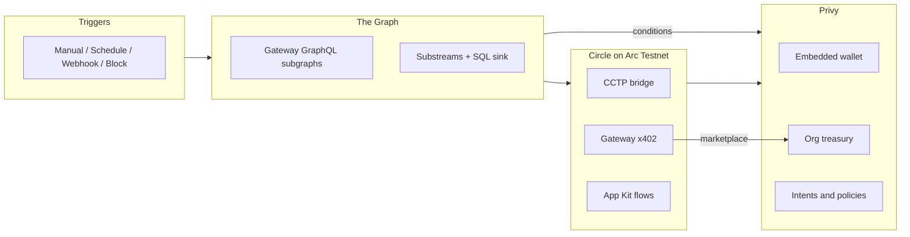

Graphitti is a visual workflow builder for **business wallets on Privy**. You connect triggers and actions, run them in the browser, then expose the same graph as an API or MCP tool. Teams get a shared treasury with policies, payees, and quorum approvals.

## Three ways to start

<CardGroup cols={3}>
  <Card title="Browser" href="/getting-started/browser">
    Sign in, connect a Privy wallet, and run a workflow on the canvas.
  </Card>
  <Card title="Agent" href="/getting-started/agent">
    Point an agent at `/mcp` and use `search_workflows` plus `call_workflow`.
  </Card>
  <Card title="API" href="/getting-started/api">
    Create a `wfb_` key and execute your own workflows over HTTP.
  </Card>
</CardGroup>

## What you can ship

- EVM reads and gasless writes through Privy
- Organization treasury with policies, key quorums, and intents on Base Sepolia
- The Graph discovery, GraphQL, Token API, and Substreams registry
- Circle wallets, CCTP, Gateway, contracts, and Mint
- Arc App Kit-style flows and Arc USDC settlement
- Fantasy Premier League public reads
- A marketplace where listed workflows charge agents per request in **Arc USDC** via Circle nanopayments (x402)

## Architecture

Product screenshots belong under `docs/images/product/` (see that folder for filenames). The [GitHub README](https://github.com/Bleyle823/Graphitti/blob/main/README.md) lists integration evidence and workflow templates in one place.
